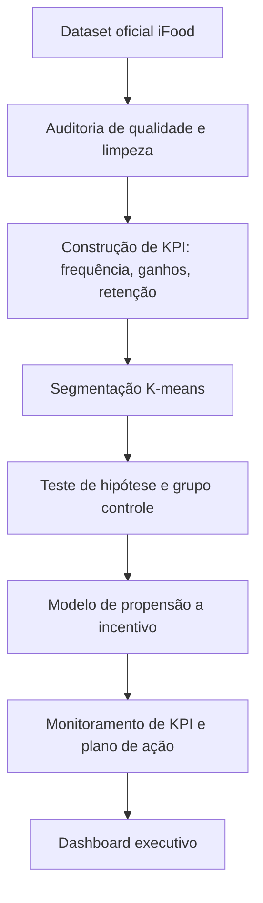
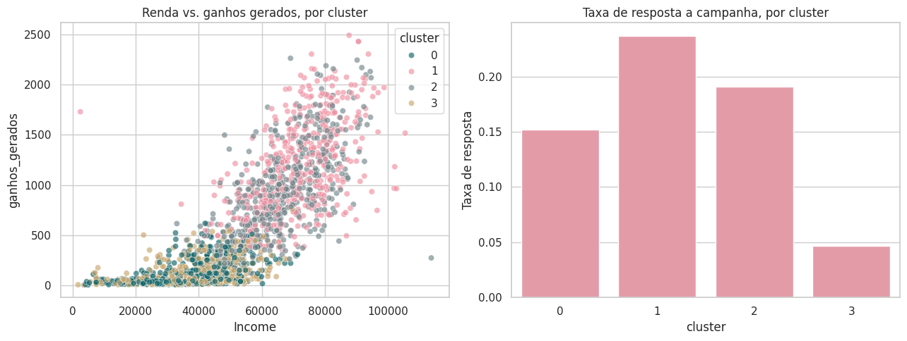
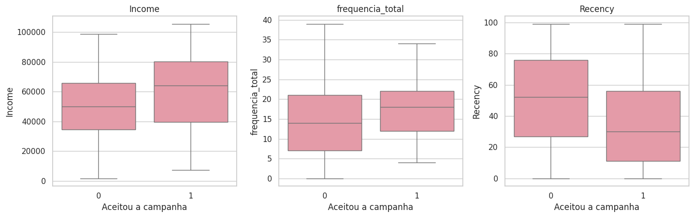
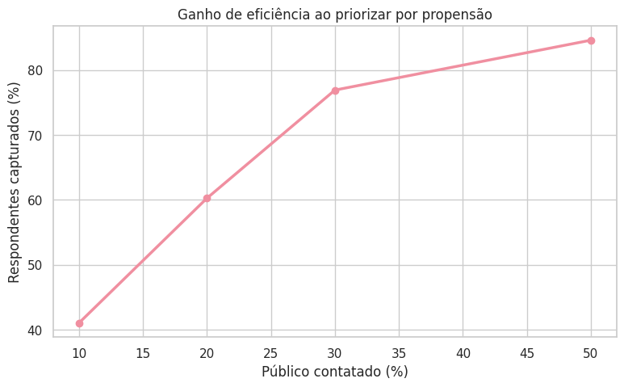

# Segmentação e Efetividade de Incentivos: Do Grupo Controle à Decisão de Negócio

**Um estudo de caso completo de BI que responde à pergunta que toda operação de incentivo precisa fazer antes de comemorar uma campanha: o incentivo realmente muda o comportamento, ou quem aceita já era diferente antes?**

Este projeto usa o **iFood Data Business Analyst Test**, dataset publicado pelo próprio time iFood Brain (`github.com/ifood/ifood-data-business-analyst-test`) para avaliar candidatos a Analista de Dados. O escopo cobre desde a auditoria da fonte, passando por construção de KPI, segmentação comportamental, teste de hipótese com desenho de grupo controle, modelo de propensão a incentivo, até monitoramento de KPI com regra de alerta e plano de ação.

> **Nota de transparência.** O dataset original descreve resposta de clientes a campanhas de marketing, e não é o Programa Super de fidelização de entregadores do iFood. Não existe dado público sobre esse programa específico. Este projeto demonstra a metodologia, transferível a qualquer operação de incentivo, usando dado real e publicamente rastreável da própria empresa.

---

## Tech Stack e Habilidades

Este repositório é um case de análise orientada a decisão, com rigor estatístico como fio condutor:

- **Python (pandas, scikit-learn, scipy):** limpeza de dados, segmentação K-means, teste de hipótese e modelo de propensão.
- **Estatística aplicada:** teste de Mann-Whitney U e qui-quadrado para validar diferença entre grupos antes de qualquer leitura de causa.
- **Visualização (Matplotlib, Seaborn, Plotly):** gráficos gerados a partir de execução real dos notebooks, não ilustrações soltas.
- **Dashboards (Streamlit, Tableau Public, Looker Studio):** o mesmo resultado, apresentado nas três ferramentas mais citadas em vagas de Analista de BI.

## Status do Projeto

| Frente de Trabalho | Status |
|---|---|
| Auditoria de fonte e qualidade de dados | Completo |
| Construção de KPI (frequência, ganhos, retenção) | Completo |
| Segmentação comportamental (K-means) | Completo |
| Teste de hipótese com desenho de grupo controle | Completo |
| Modelo de propensão a incentivo | Completo |
| Monitoramento de KPI e regra de alerta | Completo |
| Dashboard Streamlit | Completo |
| Dashboard Tableau Public | Próxima etapa |
| Dashboard Looker Studio | Próxima etapa |

## Raio-X de Resultados

| KPI | Resultado Auditado | Conceito |
|---|---:|---|
| **Clientes analisados** | **2.021** | Após remoção de 184 duplicatas exatas, 8,3% da base original |
| **Taxa de resposta geral** | **15,4%** | Aceitação da campanha mais recente |
| **Diferença de perfil entre grupos** | **p < 0,001** | Renda, frequência e recência, teste de Mann-Whitney U |
| **Faixa de resposta entre segmentos** | **4,6% a 23,7%** | Do segmento de risco de desengajamento ao segmento de alto valor ativo |
| **Ganho de eficiência do modelo** | **61,5% em 20% do público** | Captura de respondentes contatando só os de maior propensão |

## Indicadores de Negócio e Insights

1. **Viés de seleção:** o grupo que aceita campanha já chega diferente. Isso muda como qualquer resultado de campanha deveria ser lido.
2. **Segmentação comportamental:** quatro perfis de cliente, com resposta a incentivo variando em mais de cinco vezes entre o pior e o melhor segmento.
3. **Eficiência de contato:** priorizar por propensão captura a maioria dos respondentes usando uma fração do público.
4. **Monitoramento operacional:** meta por segmento, não meta única, evita alertar demais em cluster naturalmente mais frio e de menos em cluster de alto valor.
5. **Critério de elegibilidade:** o modelo de propensão dá base numérica para propor mudança de público-alvo à liderança do programa.

## Pipeline de Inteligência



## Qualidade e Integridade de Dados

| Estágio | Volume de Linhas | Delta |
|---|---:|---:|
| Base Original (Raw) | 2.205 | — |
| Base Limpa (Final) | 2.021 | −184 |

A limpeza foi conservadora, para não distorcer a leitura estatística:

- **Duplicatas exatas:** removidas antes de qualquer análise, para não inflar o peso de alguns clientes na segmentação e no teste de hipótese.
- **Valores ausentes:** nenhum encontrado na base.
- **Variável-alvo:** excluída das variáveis de segmentação, para a clusterização refletir comportamento, não a própria resposta.

## Insights Críticos de Interpretação

- **Grupo controle observacional, não experimental:** o dataset não documenta atribuição aleatória de campanha. A leitura de efeito é cuidadosa, com o viés nomeado explicitamente.
- **Base pequena para produção:** 2.021 clientes e 311 respondentes é suficiente para demonstrar metodologia, insuficiente para os padrões de um modelo em produção real.
- **Sem série temporal real:** não há carimbo de data por transação. Os ciclos usados no monitoramento são simulados para demonstrar a lógica de alerta, não uma previsão real.
- **Domínio transferível, dado literal não:** o dataset descreve clientes consumidores, não entregadores. A metodologia se aplica a qualquer programa de incentivo; os números específicos, não.







## Estrutura do Repositório

```text
ifood-segmentacao-incentivos/
├── data/                # Dataset original e versões tratadas
├── notebooks/           # Fluxo analítico em seis partes
├── reports/             # Métricas reproduzíveis (JSON)
├── exports/             # CSVs agregados prontos para Tableau/Looker Studio
├── images/              # Gráficos extraídos dos notebooks, usados neste README
└── dashboard/app.py     # Dashboard Streamlit
```

## Roteiro de Análise

| Notebook | Objetivo |
|---|---|
| `01_fonte_e_qualidade_dos_dados.ipynb` | Auditoria da fonte, dicionário de dados, limpeza de duplicatas |
| `02_frequencia_ganhos_e_retencao.ipynb` | Construção dos três KPIs centrais do incentivo |
| `03_segmentacao_de_clientes.ipynb` | Clusterização K-means e perfil de cada segmento |
| `04_testes_de_hipotese_e_grupo_controle.ipynb` | Teste estatístico de viés entre grupo que aceita e não aceita o incentivo |
| `05_modelo_de_propensao_a_incentivo.ipynb` | Modelo de propensão e visão de capacidade de contato |
| `06_monitoramento_de_kpi_e_planos_de_acao.ipynb` | Regra de alerta por desvio de meta e plano de ação por time |

## Dashboards

O projeto apresenta o mesmo resultado em três ferramentas, propositalmente, para demonstrar fluência nas ferramentas mais citadas em vagas de Analista de BI:

- **Streamlit**, em `dashboard/app.py`: protótipo interativo completo, com quatro visões do projeto.
- **Tableau Public:** construído a partir dos CSVs em `exports/`.
- **Looker Studio:** construído a partir dos mesmos CSVs.

## Como Reproduzir o Projeto

Instale as dependências:

```bash
python -m pip install pandas numpy scikit-learn scipy matplotlib seaborn plotly streamlit
jupyter notebook notebooks/
```

Execute os notebooks na ordem numérica. Para rodar o dashboard localmente:

```bash
streamlit run dashboard/app.py
```

## Ferramentas Utilizadas

Python · pandas · scikit-learn · scipy · Matplotlib · Seaborn · Plotly · Streamlit · Tableau Public · Looker Studio

## Fonte e Licença

Dataset: [iFood Data Business Analyst Test](https://github.com/ifood/ifood-data-business-analyst-test), case oficial do time iFood Brain.

Código e documentação: [MIT License](LICENSE).

Desenvolvido por `Nayane Araujo`
